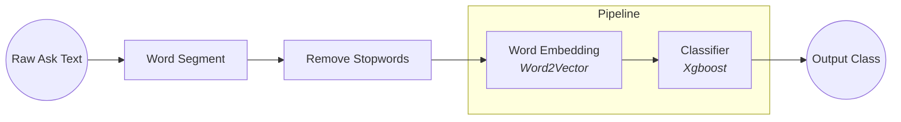
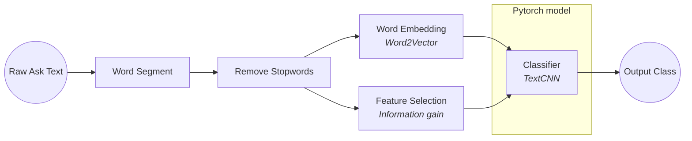

# Medical-Text-Classification-2

## **Usage**

train:

```bash
python run.py
```

## **Contents**

1. [Introduce](#introduce)
2. [Feature Selction](#feature-selection)
3. [Classification](#classification)
4. [Result](#result)
5. [Discussion](#discussion)
6. [Reference](#reference)

## **Introduce**

期末為期中的延伸，在期中報告，當時是以分詞後分類的方式試圖做出文字分類，判斷輸入問句屬於哪一種科別



但在結果上並不理想，就算僅有內科與外科的分類準確率僅有將近80%。期末想沿用其中的題目，並找方法解決期中所遇到的各種問題。。

以下為本次的 pipeline



## **Feature Selection**

雖然我有先刪除停用詞 (stopwords)，但對於分類來說還是太多詞，經 Word2Vector 模型可以得知總共有 30000 以上。在這樣的情況下有兩種選擇。

- 去除更多的詞
- 為每個詞加上權重

這邊選擇了第二種方法「特徵選擇」(Feature Selection)

而 Feature Selection 又分為很多種，應用於文字的資料上常見的有這幾種

- Document frequency
- Mutual information
- Expected cross entropy
- Odds ratio
- Chi-square statistic
- Information gain

在下面這篇中提到，information gain 對於 TODO 是最有效率的特徵擷取演算法之一，但有可能會出現雖然 information gain 很低 但其他它很重要的情況

> **Improved information gain feature selection method for Chinese text classification based on word embedding**\
> Lei Zhu1, Guijun Wang1 and Xianchun Zou\
> DOI: [10.1145/3056662.3056671](https://10.1145/3056662.3056671)

我選擇了 Information gain。


Information gain 的計算方法


以下前10重要的字詞

information_gain|word
---|---
0.0288222765244487|包皮
0.0203681765260794|肛门
0.0194295301512605|手术
0.0178957357896692|疝气
0.0169325488272825|痔疮
0.0166345430373632|乳腺
0.0149232388826061|过长
0.0143466830058858|乳房
0.0123994787547603|癫痫
0.0121461987535613|咳嗽

他提出了一個方法是利用 word space 中可以計算詞向量跟詞向量之間相似度的性質，將有可能也很重要但 information gain 過低的詞往上加，以下是他計算權重的公式。


|||
---|---
w(t, d)|word t weight in document d
tf(t, d)|frequency of word t appears in document d
N|total number of documents
n_t|number of documents in which the word t appears
phi(d)|class that document d belongs to
P(phi(d) \| t)|the probability that the word t appears in the class phi(d)
1 + P(phi(d) \| t)|to enhance the ability of the vector to distinguish text class

不過....

目前我的能力還不足以在這些時間下完成。

我的想法是，既然我有 information gain，而且 word space 是用 Word2Vec，就可以直接使用他們傳回的 list 做跟動就好。

```math
w(c)= 
```

從最高的 information gain 開始，每個跟其前十相關的字詞，自己的 information gain 加上跟它之間information gain 的差異乘以 similarity

# TODO complete formula

原本的 information 分布


更改過的分布


## **Classification**

期中所使用的分類模型是Xgboost分類樹，發現了以下問題

### **結果不明確**

因為是用字詞下去分類，分類樹只能將字詞排到某一個分類，那輸出結果就會變得不明確

```python
x= '我今天测高血压，胸闷又胸痛要怎么缓解'
xgb_pipeline.predict(ws.word_segment(x, STOP_WORDS_PATH))

>>> array([ 4,  9,  6, 13, 16], dtype=int64)
```

這是上一次的輸出結果，真看不出個所以然

### **Underfitting**

Xgboost 的推薦深度為 6~10，但期中使用的參數是 12，許多防止 overfitting 的參數也沒調高，但最後 training dataset 跟 testing dataset 的準確率是差不多的，判斷是 underfitting 了。

# TODO 加原因

為了能夠解決上述問題，把整個框架從 sklearn pipeline 換成較熟悉的 pytorch

使用TextCNN


為原有的 word vector 加上權重

> **Improving text classification with weighted word embeddings via a multi-channel TextCNN model**\
> BaoGuo,ChunxiaZhang,JunminLiu,XiaoyiMa\
> DOI: [10.1016/j.neucom.2019.07.052](https://10.1016/j.neucom.2019.07.052)

在這篇中有提到，用各種權重圖以後，可以直接相乘

```math
I_{i}=W_{i}\odotE, where \odot denotes the element-wise multiplication of two matrices
```


## Result

train 了幾次，最好的準確率只有 83%
其實除了換成其他模型，想不到還能用什麼技術讓他變得更好qq

## Discussion

還有很東西沒有嘗試，ELMo、不同的 embedding、不同的 feature selection algorithm、不同的 torch model。
之所以不用 Huggingface Bert，因為以前試過了。希望能在課堂報告利用不同的技術試試看

## Reference

[López, F. & Miller, S. (2020, September 18). Text Classification with CNNs in PyTorch. Towardsdatascience.](https://towardsdatascience.com/text-classification-with-cnns-in-pytorch-1113df31e79f)

[Chandra, A. (2018, November 15). Feature Selection in Text Classification. Towardsdatascience.](https://towardsdatascience.com/feature-selection-on-text-classification-1b86879f548e)
