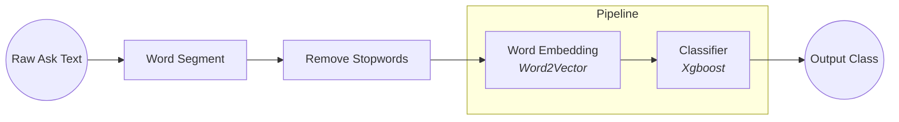
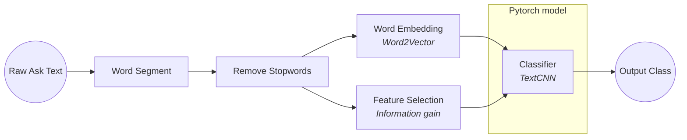

# Medical-Text-Classification-2

## **Usage**

train:

```bash
python run.py
```

## **Contents**

1. [Introduce](#introduce)
2. [Problem]
3. [Feature Selction]
4. [Classification]
5. [Result]
6. [Discussion]
7. [Reference]

## **Introduce**

期末為期中的延伸，在期中報告，以分詞後分類的方式試圖做出



但在結果上並不理想，僅有內科與外科的分類準確率僅有將近80%。期末想沿用其中的題目，並找方法解決期中所遇到的各種問題。



## **Feature Selection**

雖然我有先刪除停用詞 (stopwords)，但對於分類來說還是太多詞，經 Word2Vector 模型可以得知總共有 30000 以上。在這樣的情況下有兩種選擇

- 去除更多的詞
- 為每個詞加上權重

選擇了第二種方法「特徵選擇」(Feature Selection)

而 Feature Selection 又分為很多種，在應用於文字的資料上，常見的有這幾種

- Document frequency
- Mutual information
- Expected cross entropy
- Odds ratio
- Chi-square statistic
- Information gain

我選擇了 Information gain。在下面這篇論文中提到，雖然 information gain 是最有效率的特徵擷取演算法之一，但有可能會出現雖然 information gain 很低 但其他它很重要的情況

他提出了一個方法是利用 word space 中可以計算詞向量跟詞向量之間相似度的性質，將有可能也很重要但 information gain 過低的詞往上加，以下是他計算權重的公式。


|||
---|---
w(t, d)|word t weight in document d
tf(t, d)|frequency of word t appears in document d
N|total number of documents
n_t|number of documents in which the word t appears
phi(d)|class that document d belongs to
P(phi(d) \| t)|the probability that the word t appears in the class phi(d)
1 + P(phi(d) \| t)|to enhance the ability of the vector to distinguish text class

不過....

對這點在實作上有困難，目前我的能力還不足以在這些時間下完成

那以下前10重要的字詞

和整體資料分布

# TODO Add graph

## **Classification**

期中所使用的分類模型是Xgboost分類樹，發現了以下問題

### **結果不明確**

因為是用字詞下去分類，分類樹只能將字詞排到某一個分類，那輸出結果就會變得不明確

```python
x= '我今天测高血压，胸闷又胸痛要怎么缓解'
xgb_pipeline.predict(ws.word_segment(x, STOP_WORDS_PATH))

>>> array([ 4,  9,  6, 13, 16], dtype=int64)
```

這是上一次的輸出結果，真看不出個所以然

### **Underfitting**

Xgboost 的推薦深度為 6~10，但期中使用的參數是 12，許多防止 overfitting 的參數也沒調高，但最後 training dataset 跟 testing dataset 的準確率是差不多的，判斷是 underfitting 了。

# TODO 加原因

為了能夠解決上述問題，把整個框架從 sklearn pipeline 換成較熟悉的 pytorch

## TODO

- feature words selection
- words weight
- stemming
- feature words weight

## Problem

- too much word
  - feature selection
    - chi2
    - filter, wrapper, embedded, hybrid
    - infomation gain
- xgboost is inappreciate: underfitting
  - SVM
  - CNN
- result is not a result
  - use prob
  - CNN

## Pipeline

- word segment
- remove stopwords
- word2vec
- word weight
  - information gain
- TextCNN


```math
I_{i}=W_{i}\odotE, where \odot denotes the element-wise multiplication of two matrices
```
