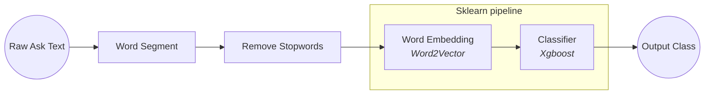

# **Medical-Text-Classification-2**

Text Classification for Medical Question

## **Dataset**

> **Dataset from Toyhom Chinese-medical-dialogue-data** \
> repo: [https://github.com/Toyhom/Chinese-medical-dialogue-data](<https://github.com/Toyhom/Chinese-medical-dialogue-data>)

## **Usage**

train:

```bash
python run.py
```

# **Contents**

1. [Introduce](#introduce)
2. [Problem](#problem)
3. [Feature Selction](#feature-selection)
4. [Classification](#classification)
5. [Result](#result)
6. [Discussion](#discussion)
7. [Reference](#reference)

# **Introduce**

期末為期中的延伸，在期中報告，當時是以分詞後分類的方式試圖做出文字分類，判斷輸入問句屬於哪一種科別



但在結果上並不理想，就算僅有內科與外科的分類準確率僅有將近80%。期末想沿用其中的題目，並找方法解決期中所遇到的各種問題。

以下為本次的 pipeline


# **Problem**

期中所使用的分類模型是Xgboost分類樹，發現了以下問題

## **結果不明確**

因為是用字詞下去分類，分類樹只能將字詞排到某一個分類，那輸出結果就會變得不明確

```python
x= '我今天测高血压，胸闷又胸痛要怎么缓解'
xgb_pipeline.predict(ws.word_segment(x, STOP_WORDS_PATH))

>>> array([ 4,  9,  6, 13, 16], dtype=int64)
```

這是上一次的輸出結果，真看不出個所以然 🤔

## **Underfitting**

Xgboost 的推薦深度為 6~10，但期中使用的參數已是 12，許多防止 overfitting 的參數也有調低，但最後 training dataset 跟 testing dataset 的準確率一直沒有起色，判斷是 underfitting 了。

「有可能」是 Xgboost 無法學習出 100 以上 dimension 的特徵，既然這樣只好換個分類模型─TextCNN

# **Feature Selection**

語料庫中有很多詞，雖然我有先刪除停用詞 (stopwords)，但對於分類來說還是太多詞，經 Word2Vector 模型可以得知總共有 30000 以上。在這樣的情況下有兩種選擇。

- 去除更多的詞
- 為每個詞加上權重

這邊選擇了第二種方法「特徵選擇」(Feature Selection)

在期中不用做是因為 Xgboost 本來就具有 feature selection 的特性。

而 Feature Selection 又分為很多種，應用於文字的資料上常見的有這幾種

- Document frequency
- Mutual information
- Expected cross entropy
- Odds ratio
- Chi-square statistic
- Information gain

選用 Information gain

## **Information gain**


Information gain 的計算方法


以下前10重要的字詞

information_gain|word
---|---
0.0288222765244487|包皮
0.0203681765260794|肛门
0.0194295301512605|手术
0.0178957357896692|疝气
0.0169325488272825|痔疮
0.0166345430373632|乳腺
0.0149232388826061|过长
0.0143466830058858|乳房
0.0123994787547603|癫痫
0.0121461987535613|咳嗽

## **Weight**

將 information gain 做 0-1 正規化成為權重使用

不過在下面這篇中提到，雖然 information gain 是最有效率的特徵擷取演算法之一，但有可能會出現雖然 information gain 很低，但其實他它很重要的情況。

> **Improved information gain feature selection method for Chinese text classification based on word embedding**\
> Lei Zhu1, Guijun Wang1 and Xianchun Zou\
> DOI: [https://doi.org/10.1145/3056662.3056671](https://dl.acm.org/doi/abs/10.1145/3056662.3056671)

他提出了一個方法是利用 word space 中可以計算詞向量跟詞向量之間相似度的性質，將有可能也很重要但 information gain 過低的詞往上加，以下是他計算權重的公式。


|||
---|---
w(t, d)|word t weight in document d
tf(t, d)|frequency of word t appears in document d
N|total number of documents
n_t|number of documents in which the word t appears
phi(d)|class that document d belongs to
P(phi(d) \| t)|the probability that the word t appears in the class phi(d)
1 + P(phi(d) \| t)|to enhance the ability of the vector to distinguish text class

不過....

目前我的能力還不足以在這些時間下完成。

我的想法是，既然我有 information gain，而且 word space 是用 Word2Vec，有一個 most_similar() 方法，使用傳回的 list 做更動就好。

從information gain 最高的開始，每個跟其前十相關的字詞，自己的 information gain 加上跟它之間information gain 的差異乘以 similarity

|word|information gain|
---|---
痔疮|0.016932548827282567

Word space 中跟痔瘡最相近的詞

|word|similarity|
---|---
'肛裂'|0.8230267763137817
'内痔'|0.8147527575492859
'外痔'|0.7933623194694519
'脱肛'|0.7309954166412354
'肛瘘'|0.7272818684577942
'痔'|0.721671998500824
'混合'|0.6459854245185852
'肛门'|0.6354331374168396
'痣'|0.6216157674789429
'肛'|0.5715659260749817

原本的 information 分布


更改過的分布


# **Classification**

為了能夠解決前面所說的問題，把整個框架從 sklearn pipeline 換成較熟悉的 pytorch，換成使用TextCNN


透過 3 到 4 次的 Convolution 1D layer，依序做出卷積

## **Weighing**

為原有的 word vector 加上權重

> **Improving text classification with weighted word embeddings via a multi-channel TextCNN model**\
> BaoGuo,ChunxiaZhang,JunminLiu,XiaoyiMa\
> DOI: [https://doi.org/10.1016/j.neucom.2019.07.052](https://www.sciencedirect.com/science/article/abs/pii/S0925231219310276)

在這篇中有提到，weight vector 與 word vector 可以直接相乘

```math
I_{i}=W_{i}\odotE, where \odot denotes the element-wise multiplication of two matrices
```


最後輸出成 class 大小

# **Result**

train 了幾次，最好的準確率依然只有 83%

試著在 TextCNN 裡面調整參數

- 降低 dropout
- 將最後的 linear layer 增加為兩層(200 -> 50 -> 2)
- 提高 converlution kernel number and kernel size

都沒有太大的改變，依然是在 80% 至 83% 徘徊


其實除了換成其他模型，想不到還能用什麼技術讓他變得更好

# **Discussion**

之所以不用 Huggingface Bert 是因為以前試過了，希望能在課堂報告利用不同的技術試試看。

還有很東西沒有嘗試，ELMo、其他不同的 word space、不同的 feature selection algorithm、不同的 torch model 等等。原本計畫要用 Latent semantic analysis，但沒看很懂，下次再挑戰。

# **Reference**

[López, F. & Miller, S. (2020, September 18). Text Classification with CNNs in PyTorch. Towardsdatascience.](https://towardsdatascience.com/text-classification-with-cnns-in-pytorch-1113df31e79f)

[Chandra, A. (2018, November 15). Feature Selection in Text Classification. Towardsdatascience.](https://towardsdatascience.com/feature-selection-on-text-classification-1b86879f548e)

[Hong, S. (2016, March 28). Improved Feature Weight Algorithm and Its Application to Text Classification. Hindawi.](https://www.hindawi.com/journals/mpe/2016/7819626/)

[Guo, B., Zhang, C., Liu, J. & Ma, X. (2019, October 21). Improving text classification with weighted word embeddings via a multi-channel TextCNN model. Neurocomputing](https://doi.org/10.1016/j.neucom.2019.07.052)

[Zhu, L., Wang, G. & Zou, X. (2017). Improved information gain feature selection method for Chinese text classification based on word embedding. ICSCA '17: Proceedings of the 6th International Conference on Software and Computer Applications, , 72–76.](https://doi.org/10.1145/3056662.3056671)

[Kim, Y. (2014). Convolutional Neural Networks for Sentence Classification.. arXiv:1408.5882 [cs.CL]](https://arxiv.org/abs/1408.5882)

[A. (2018, August 7). AliMorty/Text-Classification. Github.](https://github.com/AliMorty/Text-Classification)

[S. (2020, October 14). Shawn1993/cnn-text-classification-pytorch. Github.](https://github.com/Shawn1993/cnn-text-classification-pytorch)
